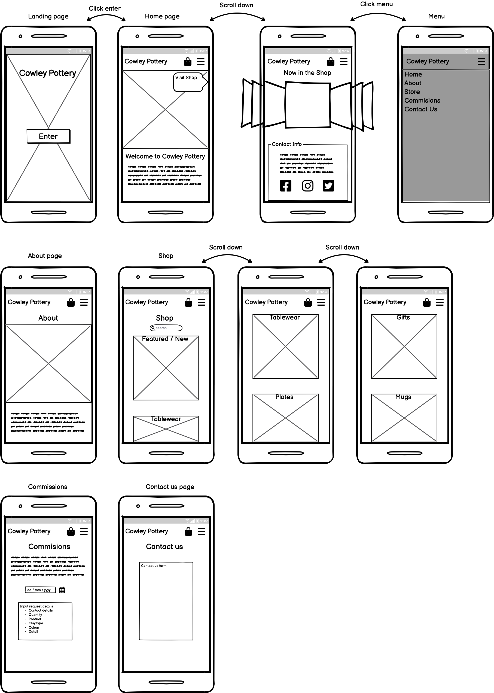
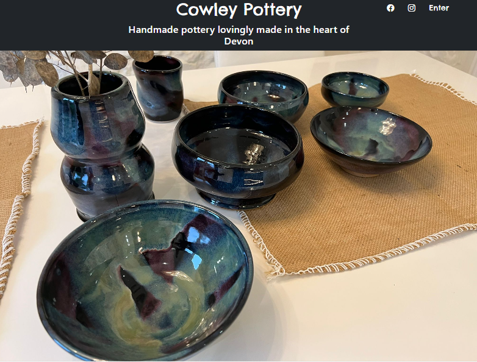
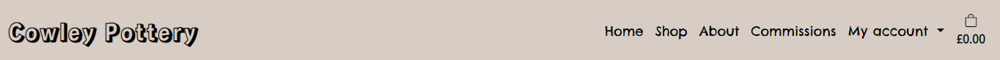
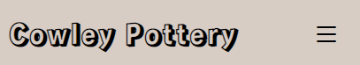
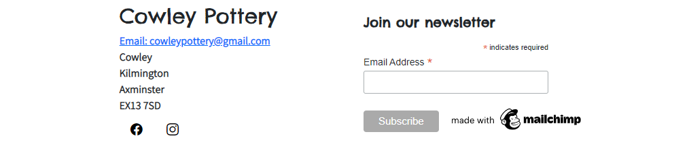
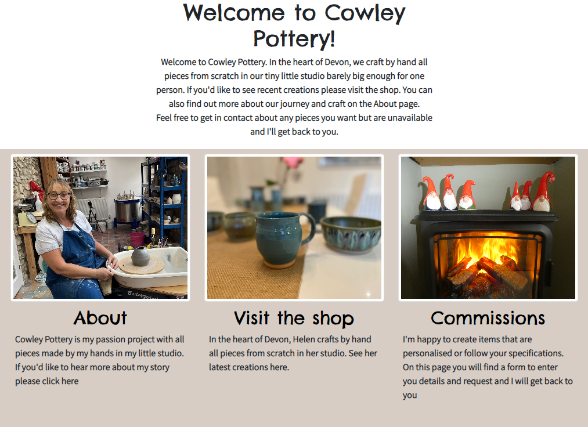
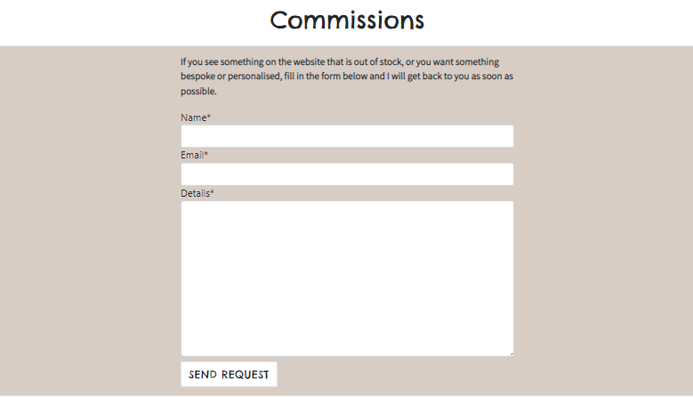
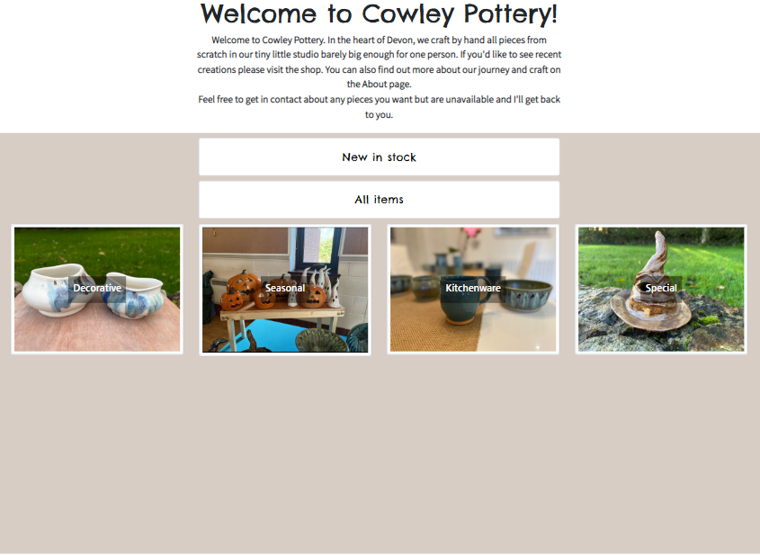
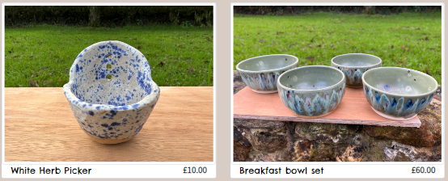
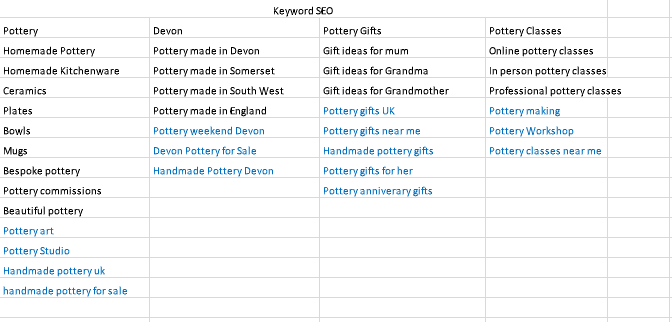

# Cowley Pottery: 

This website is being designed for use by Cowley Pottery, the pottery shop of Helen Taylor.

This is an e-commerce store built using the Django framework, Python, HTML, JavaScript and CSS. It features a Stripe payment system, numerous models to contains information regarding products, categories, profile information and commissions. The site aims to be intuitive with simple yet powerful navigation and categorisation with a paint scheme as expected from a pottery website.

This website has been created as the Fifth Milestone project for Code Institute's Full Stack Software Development Diploma. GitPod was used for writing the code for this website, as well as committing and pushing to GitHub. GitHub was then used to store the project after it had been pushed from GitPod. Once all the code had been written, Heroku was then used to deploy the website with ElephantSQL and Amazon S3 used for storage. 

The project was designed with design thinking principles at the core and the customer relationship was managed alongside agile methodologies.

### View the live website [here](https://cowley-pottery.herokuapp.com/)

***
## Table of contents: 

***
 
## Site Goals:

The goals for this site are as follows:
* Allow users to view products
* Allow users to add products to a basket
* Allow users to update or delete products from basket
* Allow users to make payments using Stripe
* Allow users to create a user profile
* Allow users to contact the store with any queries 
* Allow user to request commissions 
* Allow users to sign up for a stock newsletter
* Allow authorised users to leave product reviews
* Allow store owner to collect user data to complete orders
* Allow store owners to approve user reviews 

## Agile working and Customer centric design

I sat down with the customer and discussed the website and their wants and needs. I had conducted some research into the pottery and ceramic space online and presented a number of different websites to give an idea of how the website could look but also an idea of features that could be implemented. We started with a broad discussion about the website and core goals from which I created 5 epics that split into smaller user stories.

There were then placed onto a Kanban board and worked towards at first in week long sprints but then as my work life conditions changed, they were worked towards whenever possible. However this was still done using the user stories.

An initial mock up was created using Balsamiq from these user stories.

Every Sunday, I would speak again with the customer about the progress, the parts that have been implemented and discuss the next user stories. In these meetings I assigned the MoSCoW priorities for the next period of time.

## Business Model

The business model was determined at a very early stage. It follows that of a premium and bespoke crafts shop. Each item on the shop takes many days to create and each item is different from the next. 

The shop has been designed to take into account the nature of this shop and that only 20-30 different types of product will ever be on sale at the same time.

The majority of business for this company will come through in person sales and boutique fairs and markets and this is where the majority of the marketting will take place. However to maintain contact with these types of people and to encourage repeat purchases, business cards have been given out which with details of the Facebook and Instagram pages. This will be changed to this website once live.

Facebook and Instagram is where new custom will be generated outside of in person sales. It gives the owner of the story a way of showing her craft and it's journey from a ball of clay to the final designs. It also gives additional weight to the bespoke and hand made nature of the work. 

Commissions is the final angle in which revenue could be generated and the website shows an early version of the process that will be developed into a more expansive version going forward.

The future possibility of giving classes and therefore needing advertisement and selling has been pencilled in for next year.

## UX:

### Epics and User stories: 

The user stories can be found on the projects board. 

#### Epic 1 - Views and Navigation

Website requires web pages containing information regarding the business and the items that are for sale. It also is necessary to have the means in which to traverse the website. User stories that address this 

* As a customer I can view a list of products so that I can identify what products are available and view their images.
* As a customer I can view individual products so that I can learn more about the item such as price, description, and quantity available.
* As a customer I can quickly identify and traverse the website so that I can reach the desired part of the website.
*  As a customer I can quickly identify new stock so that I can purchase before it sells out.
* As a customer I can always see the shopping basket total so that I can be aware of how much money I am spending.
* As a customer I can view information regarding the business so that I can learn more about the artist who makes the items.

#### Epic 2 - Account Registration and Access

Users of the e-commerce website must be able to create personal accounts which are secure as well as following modern email confirmation norms. User stories that address this Epic are:

* As a customer I can create an account so that I can Store personal details, view purchases and view my profile.
* As a customer I can receive a registration confirmation email so that I can tell whether my account registration was successful.
* As a customer I can recover or reset my password so that I can regain access to my account.
* As a customer I can sign in using credentials so that I can gain access to my account whilst knowing that it is safe.
* As a customer I can log out of my account so that I can secure my account.

#### Epic 3 - Products, search, categorisation and notification

Customers of the e-commerce website must be able to search the website by name as well as view items by category. The website will be selling quality over quantity with limited stock and bespoke creations and as such notification of stock changes are essential. User stories that address this Epic are:

* As a customer I can view products by category so that I can quickly view items of a particular type.
* As a customer I can search for products by name or description so that I can find a specific item to buy quickly.
* As a customer I can sign up for a newsletter so that I can keep up to date with stock changes.

#### Epic 4 - Purchasing and Checkout

Customers must be able to view their shopping basket as well as add to it and edit any item within. They must be able to pay for their shopping basket securely and receive confirmation of purchase. User stories that address this Epic are:

* As a customer I can view the shopping basket so that I can identify what is to be purchased and its total cost.
* As a customer I can add items to shopping basket so that I can purchase them.
* As a customer I can edit items in the shopping basket so that I can alter quantity of items in basket.
* As a customer I can pay for items so that I can buy the item.
* As a customer I can feel that my personal and payment information is safe and secure so that I can confidently provide the information needed to make a purchase.
* As a customer I can see an order summary so that I can check my order before I click "pay now".
* As a customer I can receive an email receipt so that I can have evidence of my purchase.

#### Epic 5 - Admin and Store Management

The admin should be able to add new products to the store as well as edit others.

* As a shop owner I can delete products through the admin site so that I can delete items.
* As a shop owner I can add products through the admin site so that I can add new items.
* As a shop owner I can edit products through the admin site so that I can change item prices, images and descriptions.

## Development Planes:

To create a website that is comprehensive and informative for a user, as a developer you need to look at all aspects of the website and how someone who visits your website will use it. You have to consider all the user stories that have been outlined in the above sections.  

## Strategy

The strategy principle looks at user needs, as well as product/service objectives. This website's target audience was broken down into three categories:

### Roles: 

* Admin
* New User
* Existing User  

### Demographic:

* Aged between 18 to 100

#### Lifestyle:

* Collectors
* Home Decorators
* Hobbyists

#### The website needs to allow users to: 

* View products by category
* Add products to a basket
* Edit product quantities and delete products straight from the basket
* Make secure payments for their products via credit card
* Create a user profile
* Contact the store with enquiries for commissions
* Sign up for a newsletter
* Visit the store's social media accounts straight from the site 

#### The website needs to allow the store owner to:  
* Add, edit and delete products straight from the frontend site 
* Collect information from order forms
* Collect email addresses for a monthly marketing newsletter

## Scope:  

With the structure in place, it was then time to move onto the scope plane. This was all about developing website requirements based on the goals set out in the strategy plane. These requirements are broken down into two categories. 

### Content Requirements:
1. The user will be looking for:
      * A list of products that can be purchased 
      * Information about the store owner
      * Links to the store's social media accounts

### Functionality Requirements:
1. The user will be able to:
      * Learn more about the store and the owner
      * Browse all the store's products
      * Add products to a basket
      * Edit their basket
      * Complete orders using Stripe
      * Create a user account
      * Update information on a user account
      * Contact the store with enquires 
      * Sign up for a newsletter
      * Request a specific commision
      * Learn more about the store and the owner

***

## Skeleton:
Wireframes were created to set out the initial appearance of the website while also making sure to keep the end-user in mind at all times. Wireframes were created using [Balsamiq](https://balsamiq.com/). These mock ups were created for Mobile first and then for the desktop view.

Over the course of the project, the website took on a much different appearance but these served as a good initial framework.

## Surface:

***

### Colour: 
The colours used for this project were white and a grey that looks just like unfired clay! Not only in this in keeping with the product, it matches up with the general approach accross hobbyist websites which generally follow a light coloured clean and simple approach.

### Font:
Fonts used for this site were Chelsea Market and Varta, both of which have been imported from [Google Fonts](https://fonts.google.com/)

Note the "Logo" is currently shown in Rampart One but this is a place holder as the customer is looking to get a graphic designer to create an actual logo.

### Images:
The images for this project are all genuine pieces from the store either taken by me or by the customer. Some are even still available if you would like to purchase!

## Features:
There are several features on this site to help users get the most out of their visit to the site. 

## Database design

The Database architecture for the design followed the standarad e-commerce design. The order details, order line item and user profile models are all dictated by postal addresses. As such these models are the same as the Boutique ado models.

The product, category and product_category models contains all the information regarding the items to be sold and their categorisation. This schema was normalised to the Second Normal Form where every non-primary key column is functionally dependent on the entire primary key but not functionally dependent any subset. Normalization was used to keep the databases "clean" to allow for any expansion or adaptation at a later date.

The next step with the order databases and user profiles is to normalize these databases.

A simple commissions database has also been created.

### Public pages
### Landing page:

When users first travel to the site, they are met with a display of Cowley Pottery. The splash page navigation contains links to the Cowley Pottery Instagram and Facebook. The welcome paragraph is only visible on larger screens.

### Navigation:

The site can be navigated by an always in view navbar. The navbar contains the links for every section of the site. On smaller screens the navbar options become a burger icon drop down.

### Footer:

In the footer the shop name and it's address can be found alongside a newsletter subscription from 3rd party Mailchimp.

### Home page:

On the homepage, the user has the choice to go to the about page, the shop and the commissions page via image anchor and via title anchor.

### About page:

This page provides an insite into the shop owners life and craft.

### Commissions page:

On this page users can fill out a basic form that sends a request to the sites superuser. These requests are stored on the Commissions model and currently can be accessed on the website. In future they will also be emailed to the shop owner.

### Shop page:

The shop page is the where the items can be seen in their full glory.

Here the filtering of products is done through tiles rather than outdated dropdowns. There are currently six "categories" within which all the items lie although more can very easily be added. The first two "categories" are actually filters. The first presents all available shop items. Note the current stock levels are factually respresentative of the max total in stock. The second option is a "New in stock" button. This filters the products on the date they were added to the database (this is automatically generated at the model level). This is currently filtering for 4 weeks. There is an if statement to place a paragraph if there are no new items.

Note that due to the nature of this website, there is little need for a search bar as at any given time there will only be a handful of items on sale. Furthermore the website is as much of an art gallery as it is a shop and so it is important that all patrons see as much of the wares as possible.

The 4 categories are currently Kitchenware, Decorative, Seasonal and Special. If you click on a category, the options then appear in a clickable panel above the items.

These are created using a photo of the corresponding type and an overlay with the title.

The tiles in the shop are all uniform, with the name of the item underneath as well as the price in 4.

### View Product page:  

The product page shows a bigger picture of the item in question, a description as well as it's price and functionality to add it to the bag. You may only add the quantity up to what is in stock.

## Testing

Testing iterations, bugs, fixes and unresolved can be found here [Testing Document](TESTING.md)

## Technologies Used:
For this project, the following technologies were used.  

### Languages:
* HTML
* CSS
* Python
* Javascript
 

### Frameworks, Libraries, Programs & Applications Used:
* Django
* PostgreSQL
* Bootstrap
* AWS

#### Google Font
* Google Font was used to import the chosen fonts for this project.

#### GitPod
* GitPod was used for writing all the code for this project. It was also used to commit and push to GitHub.  

#### GitHub 
* GitHub was used to store this project.

#### Heroku
* Heroku was used to deploy the project.

#### Amazon Web Services
* AWS was used to store some of the images used in this project

#### Balsamiq 
* Balsamiq was used to draw initial Wireframes for this project.

#### Google Development Tools
* Google Dev Tools was used to edit code and check responsiveness before making the changes permanent.

*** 

### Marketing and SEO:

The Marketting plan was deviced using a number of different mediums.

1. The most important marketting was in person and Cowley Pottery has attended multiple crafts fair over the Christmas period with a banner and business cards with the Facebook and Instagram.
2. A live Instagram account has been created. This was used to document each time a new item was created or a fair was attended. It also helps to give the public an insight into the creative process and the artist. This is the primary social media form. As a general rule, a new Instagram post was created once a fortnight when no in person selling events are taking place and more in the build up

3. A Facebook shop page was created to use as the secondary social media form. This is used for similar purposes to Instagram but also will be used to document fairs attended. It is also VERY beneficial for peer marketting where the markets that have been attended use this page within their advertisements.

Marketing has been extensively done through Instagram. There has been additional marketting through Facebook marketplace. And associate marketing through events. A thorough summary to be written here.

SEO was tackled in a number of different ways

1. There is extensive use of heading elements as well as semantic elements through out the code
2. Keyword research has been conducted with the following list generated

The words/phrases were found using keyword search tools with those in black chosen to be used within the project as they yielded better results.

### Validation:

* HTML:

* CSS:

* JavaScript: 

### Deployment and Development:

[Deployment document](DEPLOYMENT.md)

### Credits:
* The initial setup of the Django project was done following the Code Institutes walkthrough project.  
* To my partner for her design advice 
